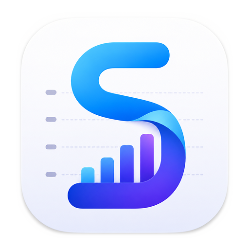
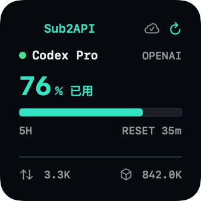
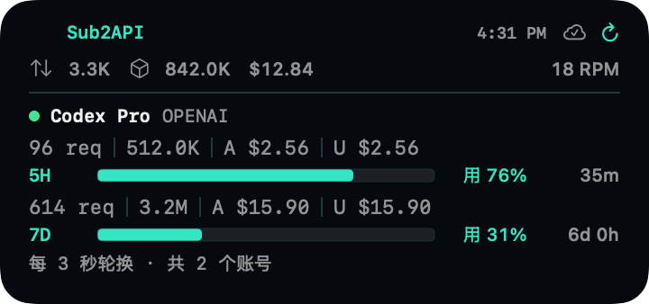
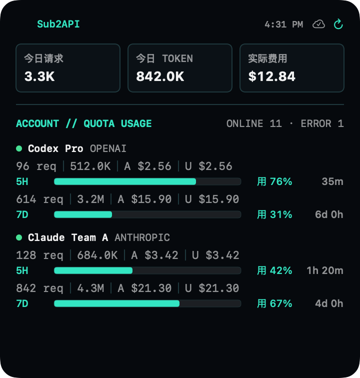

<div align="center">
  

  <h1>Sub2API Board</h1>

  <p><strong>把 Sub2API 账号额度、实时用量和系统总览放到 macOS 桌面。</strong></p>

  <p>
    <a href="../../releases/latest"></a>
  </p>

  <p>
    
    
    
    <a href="LICENSE"></a>
  </p>

  <p>
    <a href="#widget-优先">Widget</a> ·
    <a href="#功能">功能</a> ·
    <a href="#下载与安装">安装</a> ·
    <a href="#安全与隐私">安全</a>
  </p>
</div>

> [!IMPORTANT]
> Sub2API Board 基于 [MIT License](LICENSE) 开源。普通用户可以直接从 [GitHub Releases](../../releases/latest) 下载安装包，开发者也可以自行构建。

## Widget 优先

无需反复打开管理后台，在桌面就能快速查看今日请求、Token、实际费用、账号状态及不同额度窗口。支持 macOS 小、中、大三种 Widget，并按照设置的刷新间隔自动更新。

| 小号 Widget | 中号 Widget |
| :---: | :---: |
|  |  |

<p align="center">
  <strong>大号 Widget</strong><br><br>
  
</p>

> 截图使用脱敏演示数据，不包含真实服务地址、账号或费用。

## 功能

| 模块 | 能力 |
| --- | --- |
| **数据总览** | 今日请求、Token、实际费用、RPM、TPM、账号健康状态、累计数据和运行时长 |
| **额度追踪** | 5 小时、7 天、30 天或 API Key 配额利用率及重置时间 |
| **用量趋势** | 请求、Token、费用切换，支持悬停查看单日数据 |
| **账号展示** | 最多选择 6 个账号，优先展示未用尽且使用率较高的账号 |
| **桌面 Widget** | 小号和中号每次展示 1 个账号，大号展示 2 个账号，每 3 秒轮换，支持组件内手动刷新 |
| **自动恢复** | Widget 请求失败时回退到最近一次成功快照 |
| **账号安全** | 管理员邮箱与密码登录，支持 TOTP 两步验证 |

## 下载与安装

### 下载

前往 [GitHub Releases](../../releases/latest)，下载最新版本的 `.dmg` 或 `.zip` 分发包。

### 安装

1. 打开 `.dmg`，将 **Sub2API Board** 拖入“应用程序”文件夹；如果下载的是 `.zip`，解压后将 App 移入“应用程序”。
2. 在“应用程序”中找到 Sub2API Board。
3. 首次启动时，右键 App 并选择“打开”，然后在确认窗口中再次点击“打开”。
4. 如果系统仍然阻止启动，前往“系统设置 → 隐私与安全性”，找到对应提示并点击“仍要打开”。

> [!WARNING]
> 标注为“未公证测试版”的 Release 会触发 macOS Gatekeeper 提示，需要按照上述步骤手动允许。请只从本仓库的 Releases 页面下载安装包。

升级时下载新版本并覆盖“应用程序”中的旧版本即可。正常覆盖安装不会清除已有账号设置。

## 开始使用

1. 启动宿主 App，填写 Sub2API 服务根地址，例如 `https://sub2api.example.com`。
2. 使用管理员邮箱、密码及可选的 TOTP 验证码登录。
3. 在设置中选择 Widget 要展示的账号和刷新间隔，可选 `1、5、10、15、20…60` 分钟。
4. 在 macOS 桌面进入编辑模式，搜索“Sub2API 看板”，选择尺寸后添加。

> [!NOTE]
> WidgetKit 的刷新时间由 macOS 统一调度，设置值是期望的最早刷新时间，并不保证精确到分钟。账号每 3 秒轮换也可能被系统节流；可以使用 Widget 右上角或宿主 App 顶部的刷新按钮立即更新共享快照。

## 从源码构建

### 开发环境

- macOS 14 Sonoma 或更高版本
- Xcode 15.3 或更高版本
- [XcodeGen](https://github.com/yonaskolb/XcodeGen)

### 构建步骤

```bash
xcodegen generate
open Sub2APIBoard.xcodeproj
```

首次构建前，请在 Xcode 的 **Signing & Capabilities** 中为宿主 App 和 Widget Extension 选择自己的开发团队。两个 Target 必须使用一致的签名配置，并正确配置 App Group 与 Keychain Sharing，才能在 Widget 中共享登录状态和看板快照。

运行测试：

```bash
xcodebuild test \
  -project Sub2APIBoard.xcodeproj \
  -scheme Sub2APIBoard \
  -destination 'platform=macOS'
```

## 安全与隐私

- 远程 Sub2API 服务必须使用 HTTPS；仅 `localhost`、`127.0.0.1` 和 `::1` 可使用 HTTP 调试。
- 登录密码和 TOTP 验证码不会持久化。
- Access Token 与 Refresh Token 保存在共享 macOS Keychain，仅供签名一致的 App 与 Widget 使用。
- 服务地址、账号选择和最近一次看板快照保存在 App Group 容器，供 Widget 后台刷新。
- App 开启 Sandbox，仅声明出站网络、App Group 与共享 Keychain 权限。
- 退出登录会删除 Token 和共享看板快照，并刷新 Widget 时间线。
- App 不包含遥测、广告 SDK 或第三方运行时依赖。

## 系统要求

- macOS 14 Sonoma 或更高版本
- 一个可访问的 Sub2API 管理后台
- 远程服务提供有效的 HTTPS 地址

## 版本兼容

Sub2API Board 通过 Sub2API 管理接口读取看板、账号和额度数据。不同 Sub2API 版本的接口可能存在差异；如果登录成功但数据请求失败，请先升级 Sub2API Board，并在反馈时附上 App 版本、Sub2API 版本和脱敏后的错误信息。

## 反馈问题

请通过本仓库的 Issues 反馈问题。提交日志或截图前，请隐藏服务地址、邮箱、账号名称、Token、API Key 和费用等敏感信息。

## 参与贡献

欢迎提交 Issue 和 Pull Request。提交代码前请确保项目能够构建，并运行与改动范围相关的测试。安全问题中不要附带真实凭据或完整请求日志。

## 许可证

本项目基于 [MIT License](LICENSE) 开源。

---

<div align="center">
  <sub>Copyright © 2026 changqk · Released under the <a href="LICENSE">MIT License</a></sub>
</div>
